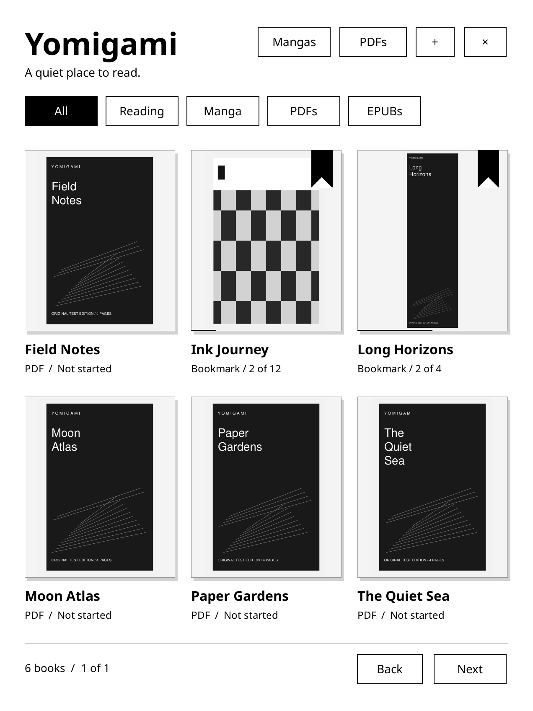
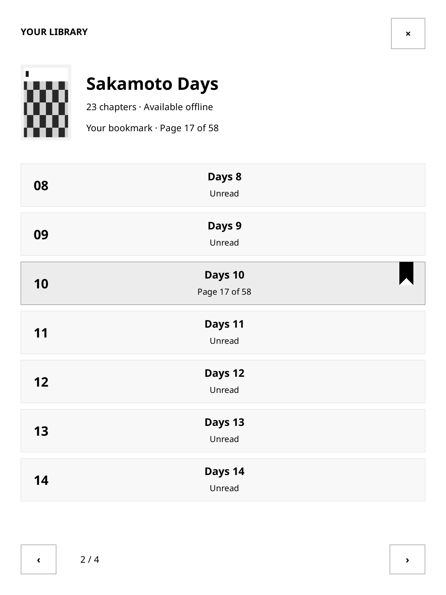
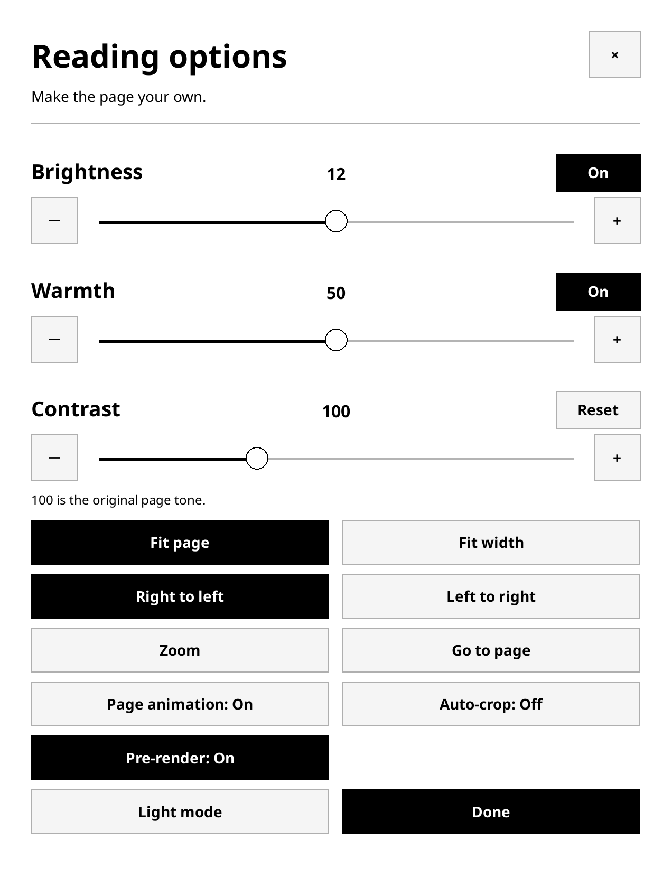

  
  
  

<b>Your manga. Your books. Your place in the story.</b> 
A standalone manga, PDF and EPUB reader that gives your Kindle a library of its own.

<a href="#a-reader-that-gets-out-of-the-way">Explore</a> · <a href="docs/INSTALL.md">Get started</a> · <a href="docs/BUILDING.md">Build</a> · <a href="CONTRIBUTING.md">Contribute</a> · <a href="#built-on-extraordinary-open-source-work">Credits</a>

## A reader that gets out of the way

Open a cover. Pick a chapter. Disappear into the page.

Yomigami brings manga and books together in a calm, cover-first library. A ribbon marks where you stopped. A tap brings back the controls. The next pages can be prepared while you read, so there is less waiting between you and the story.

It began with a simple frustration: updating KOReader could disturb the Rakuyomi reading experience. Yomigami gives the application its own home, its own state, and a pinned private runtime. Updating a separately installed KOReader does not replace Yomigami’s files.

**Independent of your KOReader installation. Deeply indebted to KOReader and Rakuyomi.**

> **Native alpha · 0.4.0.** Developed for the jailbroken Kindle Paperwhite 12th generation, with firmware 5.18.5.0.1. Core reading and page turns have been exercised on that device; the latest PDF/EPUB discovery, dark-mode and display changes still need hardware confirmation. Other models are unverified. A prebuilt installer ZIP is available for this target; nearby firmware versions are not yet verified.

## Make room for the story

| In your library | On the page | Before your next read |
| --- | --- | --- |
| Covers instead of a wall of filenames | PDF, EPUB and CBZ rendering | Search installed manga sources together |
| Chapter menus with a reading ribbon | Brightness, warmth and contrast controls | Queue every chapter in one action |
| Saved chapter and page on exit | Optional auto-crop and pinch zoom | Keep reading while manga downloads run |
| Rename, trash and restore | Light/dark mode and a hideable toolbar | Browse ebooks and import your own files |

**A shelf that remembers.** Return to the library or quit to Kindle; your current chapter and page are saved. Chapters stay together, and the reading menu opens near your bookmark.

**Pages with breathing room.** Hide the toolbar, trim large white borders, adjust the tone of a scan, or enlarge a panel. Auto-crop fills the width; tall pages pan before advancing.

**Your next chapter, prepared.** Optional pre-rendering caches four upcoming pages and the previous page, within a 32 MB budget. It reduces repeat decoding; cold pages and e-ink refresh still take time.

**One search, several shelves.** Eleven English-capable source adapters are included, including Weeb Central and MangaDex. Results identify their source. Bulk manga downloads use a persistent queue, with progress, pause, retry and background reading. Website availability and account limits still apply.

## A look inside

These are native emulator captures at the Paperwhite’s 1272 × 1696 resolution, using original test books and sample metadata. They are not device photographs.

## Get started

Yomigami needs an **already jailbroken, compatible Kindle** and a working scriptlet launcher. It does not jailbreak your device.

1. **[Download the Paperwhite 12 installer ZIP](https://github.com/KapoorCommits/Yomigami/releases/download/v0.4.0-alpha/Yomigami-0.4.0-Paperwhite12-Install.zip)** and extract it on your computer.
2. Copy `yomigami-0.4.0.tar.gz` to the Kindle storage root and `documents/Yomigami.sh` into its `documents` folder. Leave the tar.gz compressed.
3. Disconnect USB and open **Yomigami**. First launch checks the archive and installs the app.

No build tools are needed. The installer refuses to overwrite an existing Yomigami installation. See the [installation guide](docs/INSTALL.md) for details, or the [build guide](docs/BUILDING.md) to assemble it yourself. Try the original Reader Test before adding your books.

Everything lives under `/mnt/us/yomigami`. Your separately installed KOReader and Rakuyomi remain separate. Keep a backup of your reading data before installing an alpha update.

## Beyond manga

The **PDFs** button opens the PDF/EPUB browser:

- **Project Gutenberg:** search classics through Gutendex and download EPUBs.
- **Internet Archive:** discover publicly downloadable PDFs; full Archive downloads remain unverified.
- **Direct links:** import a PDF or EPUB from an HTTPS download URL.
- **Z-Library:** an independent account integration informed by ZlibraryKO’s plugin. Sign in on the Kindle with your current server address. Authenticated downloads remain unverified.

PDFDrive is listed as unavailable because the tested site returned an access error. EPUB reading uses a fixed reflow layout; font customization, text selection, annotations and DRM support are not implemented. No manga chapters or commercial ebooks are distributed with this repository.

## Honest about the early days

Yomigami is usable experimental software, not a promise that every source or every Kindle works. Source sites change. E-ink has physical refresh limits. Downloads run while the app is open; the manga queue survives restarts, but active PDF/EPUB transfers are cancelled when you quit.

The [verification record](docs/VERIFICATION.md) separates device observations, emulator checks and unverified behavior. The [architecture guide](docs/ARCHITECTURE.md) explains the private runtime and the boundaries of the upstream review.

## Built on extraordinary open-source work

**[KOReader](https://github.com/koreader/koreader)** supplies the foundation that makes this possible on Kindle: device integration, e-ink display and input handling, power lifecycle, widgets, and the native document runtime. Yomigami includes a private, adapted KOReader-derived runtime; it is not a from-scratch replacement for that engineering.

**[Rakuyomi](https://github.com/tachibana-shin/rakuyomi)** supplies the Rust source engine behind manga discovery and downloads. Its work made this standalone reading experience possible.

Thank you also to **[Aidoku Community](https://github.com/Aidoku-Community/sources)** for source adapters, **[MuPDF](https://mupdf.com/)** for document rendering, **[ZlibraryKO](https://github.com/ZlibraryKO/zlibrary.koplugin)** for the Z-Library protocol reference, and the many upstream library, font and tooling contributors.

Yomigami is an independent project, not an official release or endorsement from those projects. See [THIRD_PARTY_NOTICES.md](THIRD_PARTY_NOTICES.md) for attribution and source locations.

## Help shape the next chapter

Created and maintained by **[@KapoorCommits](https://github.com/KapoorCommits)**.

Useful bug reports, careful device testing, accessibility improvements and thoughtful pull requests are welcome. Start with [CONTRIBUTING.md](CONTRIBUTING.md). Include your device model and app version, keep changes focused, and explain how you tested them.

`@KapoorCommits` is the code owner for the whole project. Incoming PRs require the maintainer’s review under the repository’s protection policy; see [governance](GOVERNANCE.md).

If Yomigami earns a place on your Kindle, a star helps other readers find it.

## License

Yomigami application code is **[AGPL-3.0-or-later](LICENSE)**. Upstream components retain their own licenses and notices. You can inspect, modify and share the code under the applicable license terms.
